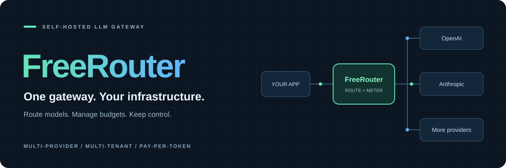
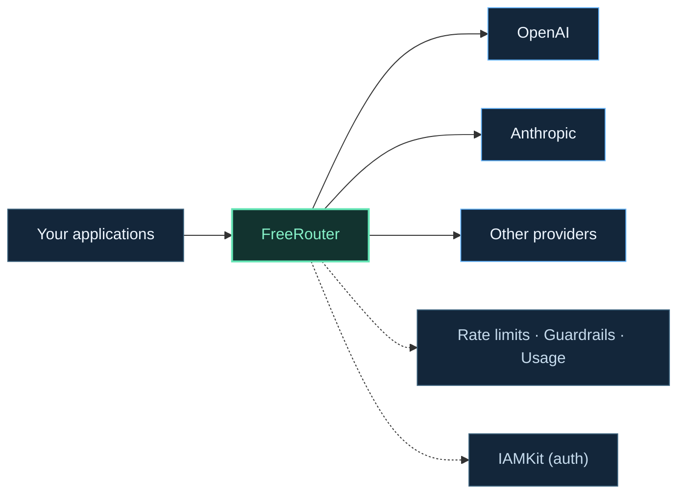

<div align="center">



# FreeRouter

**Your models. Your keys. Your gateway.**

A self-hosted LLM gateway with a Go backend and a React operator console.<br />
Connect your providers through a unified, OpenAI-compatible API, with routing, guardrails, rate limits, and observability.

<p>
  <a href="go.mod"></a>
  <a href="web/"></a>
  <a href="docker-compose.yml"></a>
  <a href="#auth-iamkit"></a>
</p>

**[Get started](#quick-start)** &nbsp; · &nbsp;
**[Explore features](#features)** &nbsp; · &nbsp;
**[API reference](#api-overview)** &nbsp; · &nbsp;
**[Architecture](#architecture)** &nbsp; · &nbsp;
**[Contribute](#contributing)**

</div>

---

## What is FreeRouter

FreeRouter is a self-hosted LLM gateway that sits between your applications and AI providers. Send requests in **OpenAI**, **Anthropic**, or **Responses API** format — FreeRouter translates and routes them to the cheapest healthy provider key across OpenAI, Anthropic, Google AI Studio, Mistral, DeepSeek, xAI, Groq, and Together AI.

It's built for teams that run their own LLM access layer: every request is authenticated, guardrail-checked, rate-limited, and logged for usage analytics — no billing system, no home-grown IAM. Auth, users, and permissions are delegated entirely to [IAMKit](https://github.com/Abraxas-365/iamkit), running as a sidecar.



---

## Why FreeRouter

<table>
<tr>
<td width="50%" valign="top">
<h3>01 · Connect once, route across providers</h3>
<p>Use OpenAI-compatible endpoints, Anthropic Messages, or the Responses API. Route through healthy provider keys with retry and model fallback chains.</p>
</td>
<td width="50%" valign="top">
<h3>02 · Put controls at the gateway</h3>
<p>Rate limits, content guardrails, and IAMKit-backed permissions give you a central place to configure access and request policies.</p>
</td>
</tr>
<tr>
<td width="50%" valign="top">
<h3>03 · Delegate identity, keep control of infra</h3>
<p>No home-grown auth — IAMKit handles users, roles, and service accounts. You keep your provider keys, your data, your Postgres.</p>
</td>
<td width="50%" valign="top">
<h3>04 · Operate on your infrastructure</h3>
<p>Run the Go backend with PostgreSQL and Redis. Manage it through the React console and inspect usage, Prometheus metrics, and webhook delivery.</p>
</td>
</tr>
</table>

**One gateway for access, routing, and observability — fully self-hosted, free and open source.**

---

## Features

| Category | What's included |
|---|---|
| **Gateway** | Chat completions, Anthropic Messages, Responses API, embeddings, transcription, speech, moderation, rerank, image generation, streaming (SSE), cost estimation |
| **Routing** | Cheapest / lowest-latency / round-robin strategies, retry + provider fallback, model fallback chains, per-subject routing config |
| **Auth** | Delegated to IAMKit — JWT introspection, scoped permissions, service accounts (API keys) |
| **Provider keys** | Encrypted upstream API keys (NaCl secretbox), per-provider, with health-based key selection |
| **Rate limiting** | Per-subject RPM + concurrency limits (Redis-backed sliding window), configurable via API |
| **Guardrails** | PII detection, secret detection, jailbreak/prompt-injection detection, custom regex rules; block, redact, or warn; violation logs |
| **Caching** | Response cache with per-subject invalidation |
| **Usage** | Async request logging: tokens, cost, timing, status, per-model summaries |
| **Webhooks** | HMAC-signed event subscriptions with delivery tracking and retry |
| **Metrics** | Prometheus endpoint: latency, tokens, errors, retries, rate-limit hits, cache hit/miss, in-flight requests |
| **Console** | React web UI: dashboard, providers, models, provider keys, rate limits, guardrails, webhooks, usage, access, service accounts |

---

## Supported Providers

FreeRouter seeds **8 providers and 58 models** out of the box via migrations. Add any additional OpenAI-compatible provider through the API.

| Provider | Example models |
|---|---|
| **OpenAI** | GPT-5, GPT-4o, GPT-4.1, o1/o3/o4-mini, GPT-3.5 Turbo |
| **Anthropic** | Claude models via the Messages API |
| **Google AI Studio** | Gemini 2.5 Pro / Flash |
| **Mistral** | Large, Small, Codestral |
| **DeepSeek** | Chat, Reasoner |
| **xAI** | Grok models |
| **Groq** | Llama, Gemma, Mixtral |
| **Together AI** | Llama, Qwen, DeepSeek R1 |

---

## Quick Start

### Prerequisites

- Go 1.26+
- Docker & Docker Compose

### Run it

```bash
git clone https://github.com/Abraxas-365/freerouter.git
cd freerouter

cp .env.example .env
make init    # generate JWT key, start Postgres + Redis + IAMKit, migrate, bootstrap
make dev     # start the server at http://localhost:3000
```

```bash
curl http://localhost:3000/health
```

### Console (optional)

```bash
cd web
npm install
cp .env.example .env   # fill in the IAMKit boundary IDs, see web/README.md
npm run dev             # http://localhost:5173
```

### First request

1. Sign in via IAMKit (see `make iamkit-logs` for the management key, and `web/README.md` for console setup)
2. Add a provider key (your own OpenAI/Anthropic/... API key) via the API or console
3. Create a FreeRouter service account (API key) with the gateway scope
4. Call it like OpenAI:

```bash
# OpenAI-compatible chat (streaming supported)
curl http://localhost:3000/v1/chat/completions \
  -H "Authorization: Bearer <your_freerouter_api_key>" \
  -H "Content-Type: application/json" \
  -d '{
    "model": "gpt-4o",
    "messages": [{"role": "user", "content": "Hello!"}]
  }'
```

<details>
<summary><strong>More request examples · Anthropic Messages and cost estimation</strong></summary>

```bash
# Anthropic Messages format — same gateway
curl http://localhost:3000/v1/messages \
  -H "Authorization: Bearer <your_freerouter_api_key>" \
  -H "Content-Type: application/json" \
  -d '{
    "model": "claude-sonnet-4-20250514",
    "max_tokens": 1024,
    "messages": [{"role": "user", "content": "Hello!"}]
  }'
```

```bash
# Estimate cost before sending
curl http://localhost:3000/v1/cost/estimate \
  -H "Authorization: Bearer <your_freerouter_api_key>" \
  -H "Content-Type: application/json" \
  -d '{"model": "gpt-4o", "messages": [{"role": "user", "content": "Hello!"}]}'
```

</details>

---

## API Overview

### Gateway (OpenAI-compatible, `/v1/*`)

| Method | Path | Description |
|---|---|---|
| `GET` | `/v1/models` | List available models |
| `POST` | `/v1/chat/completions` | Chat completions (SSE streaming supported) |
| `POST` | `/v1/messages` | Anthropic Messages API |
| `POST` | `/v1/responses` | OpenAI Responses API |
| `POST` | `/v1/embeddings` | Text embeddings |
| `POST` | `/v1/audio/transcriptions` | Audio transcription |
| `POST` | `/v1/audio/speech` | Text-to-speech |
| `POST` | `/v1/moderations` | Content moderation |
| `POST` | `/v1/rerank` | Document reranking |
| `POST` | `/v1/images/generations` | Image generation |
| `POST` | `/v1/cost/estimate` | Estimate cost before sending |

### Management (`/api/v1/*`, IAMKit-authenticated + scoped permissions)

<details>
<summary><strong>Management API · providers, gateway config, usage, and access</strong></summary>

| Area | What you can do |
|---|---|
| **Providers** | Manage providers, models, model↔provider mappings, fallback chains |
| **Provider keys** | Manage encrypted upstream API keys (BYOK) |
| **Usage** | Query request logs and usage summaries |
| **Rate limits** | Per-subject RPM and concurrency config |
| **Routing configs** | Per-subject routing strategy (cheapest, lowest-latency, round-robin) |
| **Guardrails** | Content filtering config, custom rules, and violation logs |
| **Webhooks** | Event subscriptions and delivery history |
| **Gateway** | Response cache invalidation |
| **Service accounts** | API keys backed by IAMKit service accounts |
| **Access** | Users and roles (proxied to IAMKit) |

</details>

---

## Configuration

Everything is configured via environment variables — see `.env.example` for the full list. Key settings:

| Variable | Default | Description |
|---|---|---|
| `SERVER_PORT` | `3000` | HTTP server port |
| `APP_ENV` | `development` | `development` or `production` |
| `DB_HOST` / `DB_PORT` / `DB_NAME` / `DB_USER` / `DB_PASSWORD` | `localhost` / `5432` / … | PostgreSQL connection |
| `REDIS_ADDR` | `localhost:6379` | Redis connection |
| `ENCRYPTION_KEY` | — | 32-byte hex key for encrypting stored provider API keys |
| `CACHE_ENABLED` / `CACHE_TTL_SECONDS` | `true` / `60` | Response cache for non-streaming chat completions |
| `METRICS_ENABLED` | `true` | Exposes Prometheus metrics at `GET /metrics` |
| `IAMKIT_BASE_URL` / `IAMKIT_MANAGEMENT_KEY` | — | IAMKit sidecar connection + management API key |
| `IAMKIT_ENVIRONMENT_ID` / `IAMKIT_APPLICATION_ID` / `IAMKIT_RESOURCE_ID` | — | IAMKit boundary IDs (created via IAMKit management API) |

---

## Metrics

Prometheus metrics are exposed at `GET /metrics` when `METRICS_ENABLED=true` (namespace `freerouter_gateway_*`):

| Metric | Labels |
|---|---|
| `requests_total` | model, provider, protocol, status |
| `request_duration_seconds` | model, provider, protocol |
| `tokens_total` | model, provider, type (prompt/completion) |
| `errors_total` | provider, status_code |
| `retries_total` | provider, reason |
| `rate_limit_total` | type (rpm/concurrency) |
| `cache_hits_total` / `cache_misses_total` | — |
| `in_flight_requests` | protocol |

---

## Architecture

```
cmd/server/                   # Entry point: signal handling, config load, container init
internal/
  bootstrap/                  # Composition root: wires infra + modules, registers routes
  provider/                   # Providers, models, mappings, fallback chains
  providerkey/                # Encrypted upstream API key management
  gateway/                    # Core proxy: translation, routing, upstream calls, caching, metrics
  routingconfig/               # Per-subject routing strategy configuration
  usage/                       # Async usage logging, summaries
  ratelimit/                   # Per-subject RPM + concurrency enforcement (Redis-backed)
  guardrail/                   # Content filtering: system detectors + custom rules
  webhook/                     # Event subscriptions and signed delivery
  apikey/                      # Service-account-backed API keys (IAMKit-managed)
  access/                      # Users and roles (proxied to IAMKit)
  identity/                    # Typed generic IDs
  query/ · httpx/              # Pagination and HTTP helpers
  server/                      # Fiber server, error middleware, IAMKit auth middleware
  config/                       # Env-based configuration
  errx/                         # Typed error system
web/                           # React + TypeScript + Vite operator console
migrations/                    # PostgreSQL schema + seeded providers/models
docker-compose.yml             # Postgres 16 + Redis 7 + IAMKit
```

Design principles: hexagonal architecture (ports/adapters per module, `*svc` for business logic, `*module` assemblers), raw SQL via `sqlx` (no ORM), typed generic IDs everywhere, identity and permissions delegated to IAMKit.

---

## Development

```bash
make init           # jwt-key + services up + migrate + bootstrap
make dev            # build and run the server
make up / make down # start/stop PostgreSQL + Redis + IAMKit
make migrate         # run migrations
make vet             # go vet
make lint            # golangci-lint
make test            # run tests
make test-race        # run tests with -race
```

### Tests

Unit tests run in milliseconds with no dependencies. Integration and E2E tests spin up disposable PostgreSQL and Redis containers via [testcontainers-go](https://testcontainers.com/) — one container per test function, no shared state:

```bash
go test ./...              # full suite (needs Docker)
go test -v ./internal/path/to/pkg/...   # single package
```

---

## Contributing

Issues and PRs welcome. Before submitting:

```bash
go vet ./...
golangci-lint run
go test ./...
```

Use conventional commits (`type(scope): subject`) and keep commits atomic.

---

## License

MIT

---

<div align="center">

**Connect your providers. Set your policies. Own the gateway.**

[Quick start](#quick-start) &nbsp; / &nbsp; [API reference](#api-overview) &nbsp; / &nbsp; [Configuration](#configuration) &nbsp; / &nbsp; [Contributing](#contributing)

</div>
